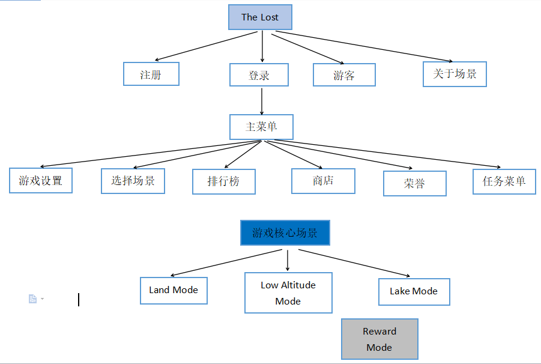
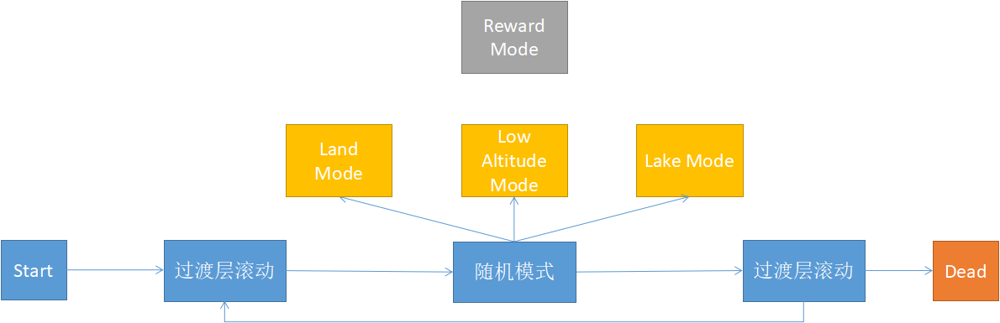
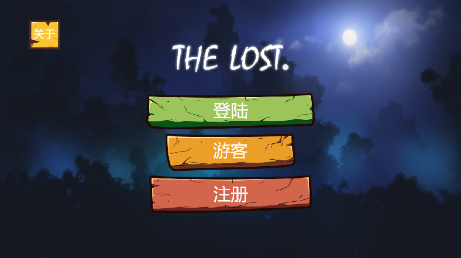
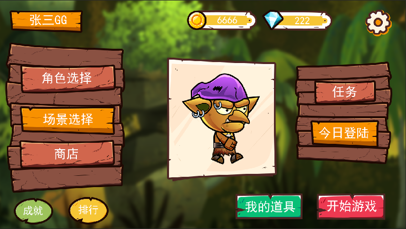
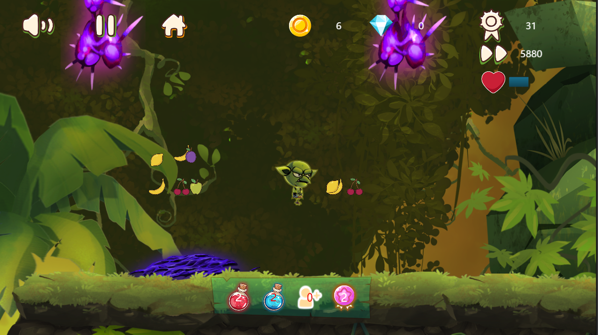
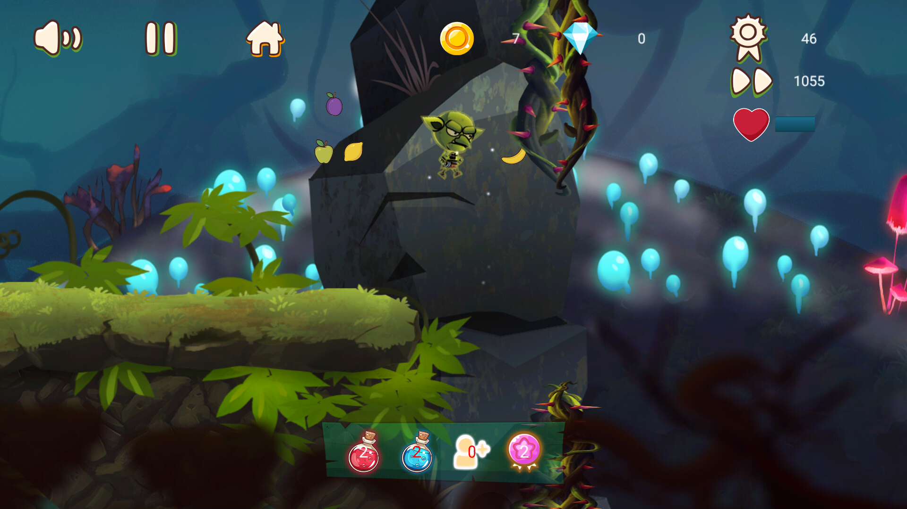
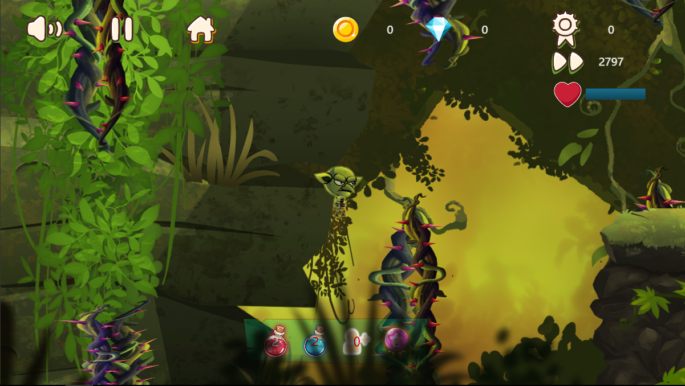
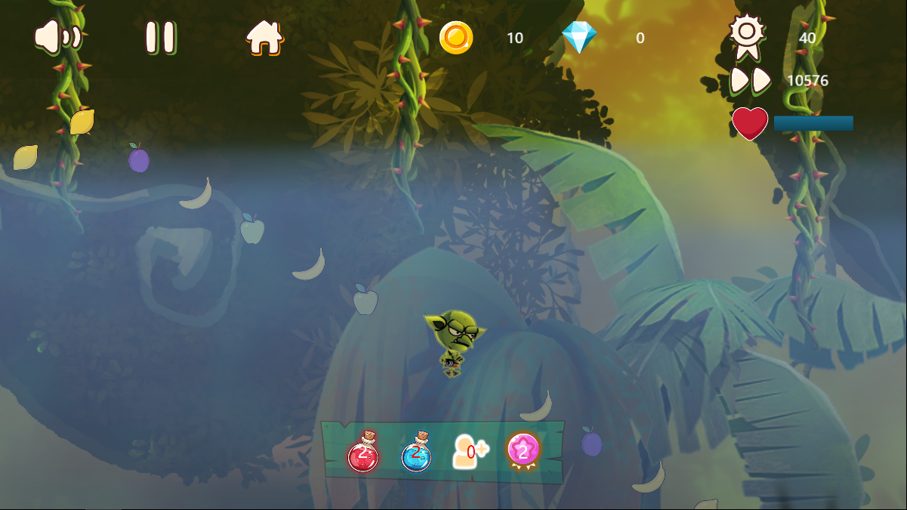
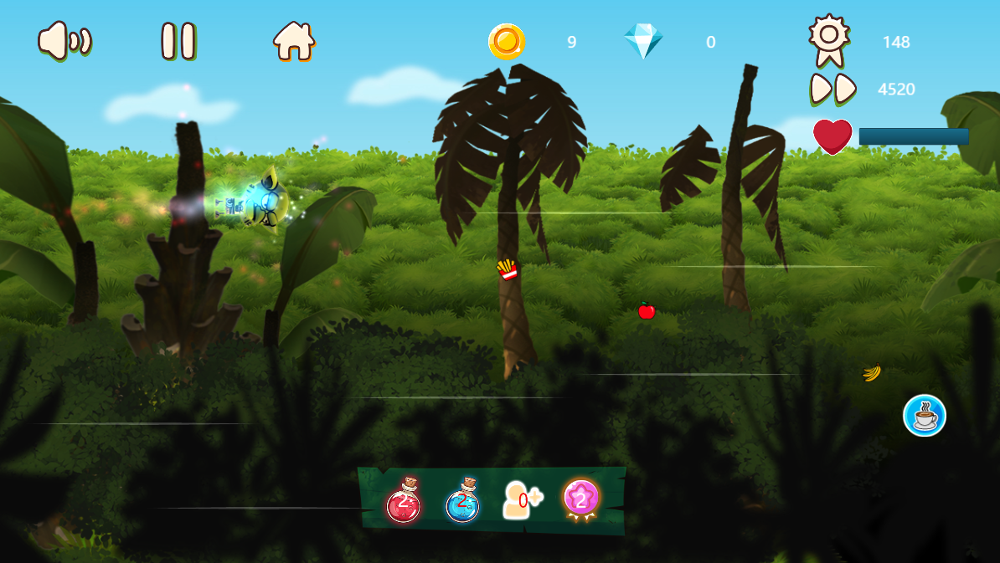

# TheLost
The game of parkour bases on COCOS engine,The Lost.(基于cocos引擎的跑酷游戏，迷失)

## 作品来源：
此作品是纯本人设计的。作品的创作灵感源于一些跑酷类手游的结合（ROD、Flappy Bird等），而场景风格布置部分参考Ori and the Blind Forest 这款pc端动作冒险类游戏布置的。

## 作品实现的主要功能
1. 玩家注册与登陆
2. 游客（离线）登陆游戏
3. 场景皮肤选择功能
4. 角色皮肤选择功能
5. 商店功能
6. 排行榜
7. 荣誉成就
8. 任务功能
游戏核心场景中，有三大模式，分为陆地模式、低空模式以及湖中模式，还有一个奖励关。

## 游戏特点
1. 游戏过程切换模式，内容丰富
2. 游戏场景皮肤的可扩展性
3. 障碍物、道具的随机性
4. 离线、有网情况都可玩
5. 平台的可扩展性

## 作品简单架构

## 技术概况:
游戏主要架构为C/S架构。
客户端，主要运用了cocos引擎的cocos2d-js版本的一些相关API。主要分为图形渲染系统、声音系统、跨平台发布、定时器、内部数据存储接口（localStorage）等特性。
服务端，主要使用Tomcat服务器，提供一些http的接口给游戏提供相关数据支持。服务器主要框架是Spring、SpringMVC、MyBatis。玩家登陆使用了shiro安全框架进行验证用户。

## 模式切换机制
游戏的核心玩法是角色在跑酷过程中会随机切换到三种模式，吃到奖励关道具会进入奖励关场景进行游戏。那么，这些模式又如何切换呢？如下图：

## 游戏效果图展示
* 开始界面

* 主菜单界面

* 普通陆地场景

* 低空场景

* 湖中场景

* 奖励关

